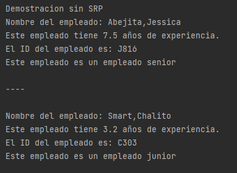
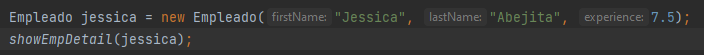
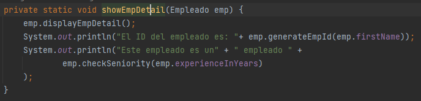
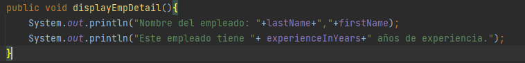
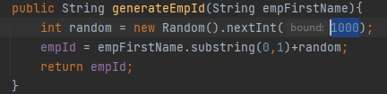
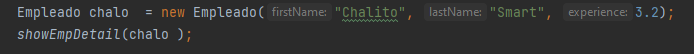
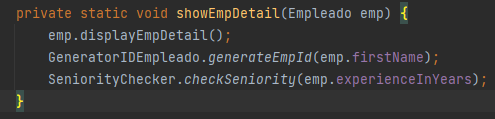
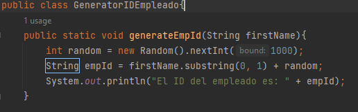
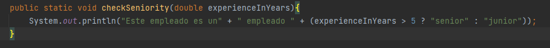

# Califica3-Grupo5
# EvaluacionGrupal2
Integrantes:  
  - Gladys Alesandra Yagi Vásquez
  - Italo Enrique Silva Guanilo
  - Renato Sebastian Perez Ruiz   
--------------------------------------------------
**Pregunta 1**  
Salida:  
    
Explicación:     
Lo primero que se realiza es la creación de un objeto de la clase Empleado con los atributos de firstName Jessica, lastName Abejita y experience de 7.5.
Luego se hace un llamado al método showEmpDetail() de la clase Cliente, pasándole como atributo el objeto creado con anterioridad.

     
Este método, lo primero que hace es invocar al método displayEmpDetail() de la clase Empleado, el cual nos imprime los nombres y los años de experiencia del empleado. 

Se genera un Id para imprimirlo con el método invocado generateEmpId() de la clase Empleado. Este Id es creado mediante la generación de un número entero random entre 0 y 1000, y la primera letra del nombre del empleado.       
     
Luego, evalúa si los años de experiencia del empleado son suficientes para ser considerado un senior(los años de experiencia deben ser mayores a 5) con el método checkSeniority() de la clase Empleado, caso contrario es un Junior, luego lo imprime.
     
Se realiza el mismo procedimiento para la creación del objeto de la clase Empleado con los atributos de nombre Chalito, apellido Smart y experiencia de 3.2.        

**Pregunta 2**     
Este diseño tiene el principal problema de que la clase Cliente contiene un método que debería pertenecer a la clase Empleado (showEmpDetail()); ya que lo único que este método hace es que por medio del atributo de tipo Empleado que recibe, llama a métodos de la clase Empleado. 

**Pregunta 3**     
Se modificó el método showEmpDetail() de la clase Cliente para llamar a los métodos de las clases creadas GeneratorIDEmpleado(método generateEmpId()) y SeniorityChecker(método checkSeniority()).      
     
En las clases creadas, los métodos creados son de tipo estático para no tener que crear un nuevo objeto de cada una de las clases.
       
       
**Pregunta 4**    
Empleado.java       
Tenemos una clase que instancia un objeto con los atributos de firstName, lastName y experience. También cuenta con un método que imprime los atributos del objeto.
Esta clase cumple con el principio ya que todo lo que contiene solo tiene que ver con su propia clase en sí.        
GeneradorIdEmpleado.java       
Esta clase solo contiene un método para crear un Id a partir del atributo firstName de un objeto Empleado.      
SeniorityChecker.java       
Esta clase solo contiene un método para verificar si el atributo de experience del objeto Empleado se considera un junior o senior.     
Cliente.java     
Esta clase tiene como responsabilidad englobar a las clases Empleado, GeneradorIdEmpleado y SeniorityChecker; mediante la creación de objetos de tipo Empleado y empleando su propio método showEmpDetail para los métodos de cada clase englobada.     
Cada una de las clases tiene una única responsabilidad.
