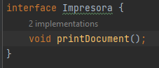

# Calificada3-Grupo5
Integrantes:  
  - Gladys Alesandra Yagi Vásquez
  - Italo Enrique Silva Guanilo
  - Renato Sebastian Perez Ruiz   
--------------------------------------------------
**Pregunta 1**  
Salida:  
    
Explicación:     
Lo primero que se realiza es la creación de un objeto de la clase Empleado con los atributos de firstName Jessica, lastName Abejita y experience de 7.5.
Luego se hace un llamado al método showEmpDetail() de la clase Cliente, pasándole como atributo el objeto creado con anterioridad.

     
Este método, lo primero que hace es invocar al método displayEmpDetail() de la clase Empleado, el cual nos imprime los nombres y los años de experiencia del empleado. 
         
Se genera un Id para imprimirlo con el método invocado generateEmpId() de la clase Empleado. Este Id es creado mediante la generación de un número entero random entre 0 y 1000, y la primera letra del nombre del empleado.       
         
Luego, evalúa si los años de experiencia del empleado son suficientes para ser considerado un senior(los años de experiencia deben ser mayores a 5) con el método checkSeniority() de la clase Empleado, caso contrario es un Junior, luego lo imprime.     
         
Se realiza el mismo procedimiento para la creación del objeto de la clase Empleado con los atributos de nombre Chalito, apellido Smart y experiencia de 3.2.        
     
**Pregunta 2**     
Este diseño tiene el principal problema de que la clase Cliente contiene un método que debería pertenecer a la clase Empleado (showEmpDetail()); ya que lo único que este método hace es que por medio del atributo de tipo Empleado que recibe, llama a métodos de la clase Empleado. 

**Pregunta 3**     
Se modificó el método showEmpDetail() de la clase Cliente para llamar a los métodos de las clases creadas GeneratorIDEmpleado(método generateEmpId()) y SeniorityChecker(método checkSeniority()).      
     
En las clases creadas, los métodos creados son de tipo estático para no tener que crear un nuevo objeto de cada una de las clases.      
           
           
**Pregunta 4**    
Empleado.java       
Tenemos una clase que instancia un objeto con los atributos de firstName, lastName y experience. También cuenta con un método que imprime los atributos del objeto.
Esta clase cumple con el principio ya que todo lo que contiene solo tiene que ver con su propia clase en sí.        
GeneradorIdEmpleado.java       
Esta clase solo contiene un método para crear un Id a partir del atributo firstName de un objeto Empleado.      
SeniorityChecker.java       
Esta clase solo contiene un método para verificar si el atributo de experience del objeto Empleado se considera un junior o senior.     
Cliente.java     
Esta clase tiene como responsabilidad englobar a las clases Empleado, GeneradorIdEmpleado y SeniorityChecker; mediante la creación de objetos de tipo Empleado y empleando su propio método showEmpDetail para los métodos de cada clase englobada.     
Cada una de las clases tiene una única responsabilidad.

**Pregunta 5**  
Como nos dice el enunciado previo a la pregunta,el método displayResult() nos muestra los detalles necesarios de un estudiante; sin embargo, en la clase Estudiante tenemos el metodo sobreescrito toString() el cual nos muestra los detalles del estudiante, por lo que sería innecesario implementar el método en la clase Estudiante.
Para el método evaluateDistintion() podemos observar que la clase DistintionDecider tenemos una lista de String para los departamentos, por lo que si se desea añadir este método en la clase Estudiante se deberia tambien definir estas listas, pero al hacer esto en cada llamada se crearia una nueva lista.  
  
**Pregunta 6**  
Resultados:  
  
Explicación:  
       
Primero a través de la clase Cliente se crea una lista de tipo Estudiante que llama a la funcion enrollStudents() que crea y agrega objetos de tipo de Estudiante devolviendo la lista con los objetos añadidos  
  
Luego imprimimos los atributos de cada objeto de la lista de tipo Estudiante, ademas verificamos que objetos tienen distinciones mediante el método evaluateDistinction() de la clase DistintionDecider, el cual nos dice que dependiendo del departamento pertenezca y ademas supere un score minimo este imprime que el estudiante recibió una distinción  
  
  
**Pregunta 7**
  
El problema que se tiene principalmente es cuando se llama a la clase DistintionDecider, su método para verficar si se obtiene una distinción, genera dos listas de los departamentos a los que pertenecen cada uno; esto nos genera un problema si deseamos añadir mas departamentos ya que tendriamos que estar haciendo varias comprobaciones para cada una de ellas, lo mejor sería generar subclases de la clase Estudiante, el cual ya tenga n método que diga si el estudiante merece una distinción.  
  
**Pregunta 8**  
  
Generamos la interfaz DistintionDecider con el método evaluationDistinction() el cual es abstacto por pertenecer a la interfaz      
       
  
**Pregunta 9**  
  
Para las clases ArtsDistinctionDecider y ScienceDistinctionDecider que implementan la interfaz sobreescribimos el método evaluateDistinction() verificando que cumpla el score mínimo para que pueda obtener la distinción   
  
  
  
**Pregunta 10**  
  
Salida:  
       
Explicación:        
- Estudiante.java         
La clase abstacta solo declara nuestros parametros que usaremos para definir cualquier objeto de este tipo(name, regName,score)  
- ArteEstudiante.java y CienciaEstudiante.java  
Ambas clases extienden de la clase abstracta Estudiante y son dos tipos de esta.  
- DistintionDecider.java  
Es una interfaz que declara el metodo que usaran as clases que implementaran.  
- ScienceDistinctionDecider.java y ArtsDistinctionDecider.java  
Clases que implementan la interfaz DistintionDecider y nos evalua si el estudiante de su departamento obtienen una distionción 
- Cliente.java    
       
El método main() nos creara dos listas de alumnos de los departamentos de Ciencia y Arte mediante los métodos enrollScienceStudents() y enrollArtsStudents() respectivamente. Ambos métodos nos crean y agregan objetos de tipo Estudiante a cada una de las listas.
Luego imprimiremos ambas listas de los departamentos, posteriormente las listas de estudiantes de los departamentos de ciencia y artes llamaran a las clases ScienceDistinctionDecider y ArtsDistinctionDecider respectivamente para poder determnar a aquellos estudiantes que hayan obtenido distincion en esos departamentos.  
  
**Pregunta 11**  
  
Las ventajas de este tipo de diseño son:  
- Si necesitamos crear un estudiante directamente lo haremos en las listas de cada departamento(Ciencia o Artes) así evitandonos una comprobación extra.  
- Si deseamos agregar un nuevo departamento con su respectiva verificación lo que debemos hacer es crear una nueva lista en la clase Cliente con los respectivos estudiantes,
y para la verificación se crearía una nueva clase que extienda de la interfaz DistintionDecider generando una forma simplificada de declaración.  

**Pregunta 12**  
Salida:  

  

Explicación:  
En la clase Cliente, creamos dos usuarios que están registrados, "Abejita" y "Chalito", y una instancia de la clase PaymentHelper, 'helper'.
  
Añadimos los usuarios a la lista de 'helper' y usamos su método showPreviousPayments(), el cual, de dicha lista de usuarios, llama al método previousPaymentInfo() de cada usuario para mostrar los detalles de sus últimos pagos realizados.  
  
  
Luego, de manera similar, llamamos al método processNewPayments(), el cual, itera la lista de usuarios y hace llamada al método newPayment() de cada usuario para mostrar las solicitudes de pago actuales.  
  

**Pregunta 13**  
Implementación de la clase GuestUserPayment:

  

**Pregunta 14**  
  

Se encuentra la excepción UnsupportedOperationException() debido al método previousPaymentInfo() de la nueva clase GuestUserPayment. Esto debido a que un usuario invitado no tiene un historial de pagos. Esto se podría solucionar con un if-else en el método showPreviousPayments() de la clase PaymentHelper el cual solo hará llamado al método previousPaymentInfo() para los usuarios que estén registrados.

**Pregunta 15**  

Si quisieramos añadir más tipos de clientes, para la solución dada en la pregunta anterior, se tendría que estar añadiendo más clausulas if-else para cada nuevo tipo de cliente.

**Pregunta 16**  

Interfaces:  
  
  
Usuarios:  
  
  
Clase PaymentHelper:  
  

Clase Cliente:  
  

**Pregunta 17**

Se han separado los métodos que antes estaban en Payment por dos nuevas interfaces, PreviousPayment y NewPayment, con esto podemos definir que tipo de usuario debería poder usar dichos métodos implementando las adecuadas interfaces. Así cada usuario registrado podrá ver su historial de pagos realizados y realizar nuevas operaciones, mientras que el usuario invitado solo podrá realizar nuevas operaciones.

**Pregunta 18**  

Método estático para las nuevas solicitudes de pago:  
  

Uso del método estático en la clase Cliente:  
  

Resultados:  
  

**Pregunta 19**  
Debido a que  la clase ImpresoraBasica no deberá poseer un método sendFax() ya que no necesita de este para funcionar, dado que cada vez que hagamos
alguna modificación en el método sendFax() de la clase ImpresoraAvanzada tambien nos hará modificar el método de ImpresoraBásica  

**Pregunta 20**  
El problema es tener que estar modificando el método sendFax() de la clase ImpresoraBasica cuando esta no necesita dicho método.  

**Problema 21**  
Para eliminar el problema se crea una interfaz Fax que extienda de la interfaz Impresora y contenga el método sendFax() que quite el sendFax() de Impresora, asi evitamos que si modificamos algo
en este método la clase ImpresoraBasica tenga que tambien tener que modificarse.
    
Además de modificar el implements de la calse ImpresoraAvanzada hacia Fax para que asi pueda tener ambos métodos.  

**Pregunta 22**  
No ya que la clase ImpresoraBasica no necesita del método sendFax().
  
**Pregunta 23**  
Tal como se ha visto en las preguntas anteriores el método que no se va a usar en la clase ImpresoraBasica se pondrá en un interfaz nueva que extienda de la interfaz principal para asi el método no tenga que estar modificandose en clases donde no se usa.

**Pregunta 24**  
El codigo no bota un error dado que el metodo sendFax esta comentado, pero si descomentamos la instruccion impresora.sendFax() nos botará un error
  
Esto se debe a que se llama al método sendFax de la función ImpresoraBasica nos botara una excepcion si se ejecta. Lo mismo sucedera si se omenta esta instruccion
y se descomenta la instrucción dispositivo.sendFax() ya que es la misma llamada al método antes mencionado.  

**Pregunta 25**  
La funcion lambda que se usara es:  
  
Se uso el método foreach para pasarle la expresión lambda de printDocument  

**Pregunta 26**  
Salida:  
  

Explicación:

  

Lo primero que realiza es crear un objeto de tipo ImpresoraAvazada que extiende de la interfaz Impresora, luego se realiza los métodos que tiene este tipo de impresora
printDocument() y sendFax() los cuales nos muestra que la impresora imprime y envia un fax.
Posteriormente se crea un objeto de la clase ImpresoraBasica el cual le diremos que nos muestre que la impresora imprime.  

**Pregunta 27**  
Se implementa las interfaces con los respectivos métodos:  

    
Las clases ImpresoraAvanzada e ImpresoraBasica quedan de la siguiente forma  

  
  
La clase Cliente  

  
Lo primero que realiza es la creacion de un objeto impresora de tipo ImpresoraBasica e indica que imprime, debido al polimorfismo dicho objeto es ahora del tipo ImpresoraBasic para luego mostrarnos que imprime.
Luego nos crea un objeto de la interfaz Fax del tipo ImpresoraAvanzado y nos muestra que envia un fax.
Asi nos quedara la salida:
  
  
**Pregunta 28**  
Al declarar un metodo prederminado en la interfaz, hará que si en caso en alguna de las clases que implementa dicha interfaz no sobreescribe alguno de los métodos, este tomara el valor con el cual se le declaro en la interfaz.  
  
**Pregunta 29**  
Como se explica en la pregunta anterior en caso de qe alguna clase no sobreescriba el método de fax, entonces este mostrará lo que se haya declarado en la interfaz. El principal problema es que si un programa no esta usando el principio de segregación de interfaz
y lla clase ImpresoraBasica no lo sobreescribe nos mostrará que este tipo de impresora esta enviando un fax cuando esto no es posible.  
  
**Pregunta 30**  
Al usar un método vacío en lugar de lanzar una excepción en el método sendFax() de la clase ImpresoraBasica, al ser invocado este método no hara nada y en caso de tener una sentencia posterior a su llamada la ejecutara sin ningun problema, en cambio si tiene una excepcion el programa se cortará al invocar al método.

**Pregunta 31**  
Salida:     
     
La clase cliente crea un objeto de clase InterfazUsuario, el llama al método saveEmployeeId() que recibe como atributo Id un string.        
       
La clase InterfazUsuario tiene un constructor que instancia la clase OracleDatabase donde se "guardaran" los usuarios y para guardarlos tiene el método saveEmployeeId() que llama al método saveEmpIdInDatabase() de OracleDatabase.       
       
La clase OracleDatabase imita a una base de datos, guardando al usuario, y para validar que lo ah "guardado", imprime el Id.        
       

**Pregunta 32**      
La dependencia de la clase UserInterface (una clase de alto nivel) de la clase OracleDatabase,  hace que cualquier cambio en la clase OracleDatabase(clase de bajo nivel) necesite realizar cambios en la clase UserInterface.      

**Pregunta 33**      
La clase InterfazUsuario.       
       
Interfaz BaseDatos.     
      
Clase MySQLDatabase     
    
Clase OracleDatabase        
  
**Pregunta 34**   
Salida:         
    
Explicación:        
       
Se crea un objeto de tipo InterfazUsuario, el cual luego se le pasará un objeto de tipo BaseDatos.       
A continuación, se le pasa un objeto de tipo OracleDatabase; y 
se llama al método saveEmployeeId() de la clase InterfazUsuario, el cual recibe como atributo un string("E003").
Este método llama al método saveEmpIdInDatabase() de la base de datos a la cual pertenece (Oracle o MySQL) y nos imprime a la base de 
datos que pertenece el usuario. Esto mismo procedimiento se repite para la base de datos MySQLDatabase.

**Pregunta 35**   
Cuando necesitamos que la clase de alto nivel dependa de la clase de bajo nivel como en el caso de restringir las instancias de las clases de bajo nivel creadas en un punto determinado.      

**Pregunta 36**   
Permite hacer un cambio a la base de datos pero conservando el mismo objeto.        
       
       
